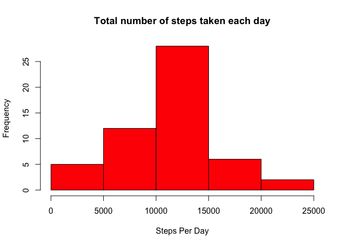
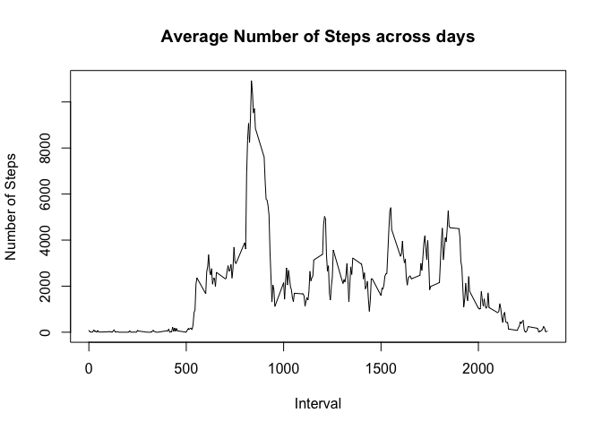
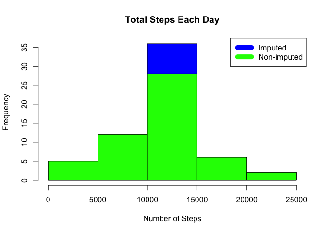
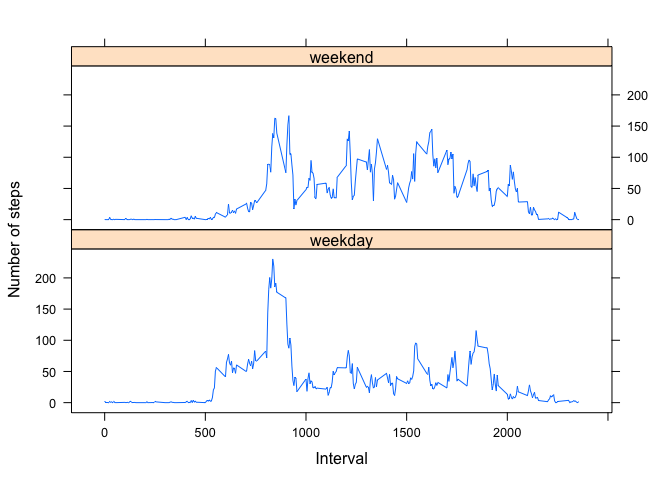

## Loading and preprocessing the data

1. First load the data. We want the data columns to be of the right type. 

```r
library(dplyr)
```

```
## 
## Attaching package: 'dplyr'
```

```
## The following objects are masked from 'package:stats':
## 
##     filter, lag
```

```
## The following objects are masked from 'package:base':
## 
##     intersect, setdiff, setequal, union
```

```r
if (!file.exists("activity.csv") )
{
      unzip('activity.zip')
}

# Read data
data <- read.csv("activity.csv", stringsAsFactors=FALSE, colClasses = c("numeric", "character", "numeric")) 
```

2. Process/transform the data (if necessary) into a format suitable for your analysis


```r
# remove na values
dataTidy = data[!is.na(data$steps), ]
# add dates correctly
dataTidy <-  select(dataTidy, c(steps,date, interval)) %>%
  mutate(date = as.POSIXct(date))
#aggregate the sum of steps by date
sumStep = aggregate(steps~date, dataTidy, sum)
```


## What is mean total number of steps taken per day?


```r
#histogram for total steps taken per day
hist(sumStep$steps, col="red", main="Total number of steps taken each day", xlab="Steps Per Day")
```

<!-- -->

```r
rmean <- mean(sumStep$steps)
rmedian <- median(sumStep$steps)
# mean total number of steps
print(rmean)
```

```
## [1] 10766.19
```

## What is the average daily activity pattern?


```r
#Calculate total steps for each interval for all days
totSteps = aggregate(steps~interval, dataTidy, sum)

#Make a time series plot (i.e. \color{red}{\verb|type = "l"|}type = "l") of the 5-minute interval (x-axis) and the average number of steps taken, averaged across all days (y-axis)
plot(totSteps$interval,totSteps$steps, type="l", xlab="Interval", ylab="Number of Steps",main="Average Number of Steps across days")
```

<!-- -->

```r
#check which 5-minute interval contains the maximum number of steps
maxIdx = which.max(totSteps$steps)

#Which 5-minute interval, on average across all the days in the dataset, contains the maximum number of steps?
maxInterval = totSteps[maxIdx, 'interval']
print(maxInterval)
```

```
## [1] 835
```

## Imputing missing values


```r
# Calculate and report the total number of missing values in the dataset (i.e. the total number of rows with \color{red}{\verb|NA|}NAs)

NATotal <- sum(!complete.cases(data))

# Devise a strategy for filling in all of the missing values in the dataset. The strategy does not need to be sophisticated. For example, you could use the mean/median for that day, or the mean for that 5-minute interval, etc.

meanSteps <- aggregate(steps ~ interval, data, mean)
fillNA <- numeric()
for (i in 1:nrow(data)) {
  obs <- data[i, ]
  if (is.na(obs$steps)) {
    steps <- subset(meanSteps, interval == obs$interval)$steps
  } else {
    steps <- obs$steps
  }
  fillNA <- c(fillNA, steps)
}

# Create a new dataset that is equal to the original dataset but with the missing data filled in.
new_activity <- data
new_activity$steps <- fillNA

# Make a histogram of the total number of steps taken each day and Calculate and report the mean and median total number of steps taken per day. Do these values differ from the estimates from the first part of the assignment? What is the impact of imputing missing data on the estimates of the total daily number of steps?
  
StepsTotalUnion <- aggregate(steps ~ date, data = new_activity, sum, na.rm = TRUE)
hist(StepsTotalUnion$steps, main = paste("Total Steps Each Day"), col="blue", xlab="Number of Steps")
hist(sumStep$steps, main = paste("Total Steps Each Day"), col="green", xlab="Number of Steps", add=T)
legend("topright", c("Imputed", "Non-imputed"), col=c("blue", "green"), lwd=10)
```

<!-- -->

```r
#calculate Mean
rmeantotal <- mean(StepsTotalUnion$steps)
rmeantotal
```

```
## [1] 10766.19
```

```r
#calculate median
rmediantotal <- median(StepsTotalUnion$steps)
rmediantotal
```

```
## [1] 10766.19
```

```r
#Do these values differ from the estimates from the first part of the assignment?
rmediandiff <- rmediantotal - rmedian
print(rmediandiff)
```

```
## [1] 1.188679
```

```r
rmeandiff <- rmeantotal - rmean
print(rmeandiff)
```

```
## [1] 0
```

## Are there differences in activity patterns between weekdays and weekends?

```r
#   For this part the \color{red}{\verb|weekdays()|}weekdays() function may be of some help here. Use the dataset with the filled-in missing values for this part.

# Create a new factor variable in the dataset with two levels – “weekday” and “weekend” indicating whether a given date is a weekday or weekend day.
new_activity <-  select(new_activity, c(steps,date, interval)) %>%
     mutate(date = as.POSIXct(date))
new_activity['dateIs'] = factor(sapply(new_activity$date, function(x){ if (weekdays(x) == "Sunday" | weekdays(x) == "Saturday") { "weekend" } else { "weekday"} }))

# Make a panel plot containing a time series plot (i.e. \color{red}{\verb|type = "l"|}type = "l") of the 5-minute interval (x-axis) and the average number of steps taken, averaged across all weekday days or weekend days (y-axis). See the README file in the GitHub repository to see an example of what this plot should look like using simulated data.
avgStepDateIs = aggregate(steps~interval + dateIs, mean, data=new_activity)
library(lattice)
xyplot( steps ~ interval | dateIs, data = avgStepDateIs, type="l", layout=c(1,2), xlab="Interval", ylab="Number of steps")
```

<!-- -->
